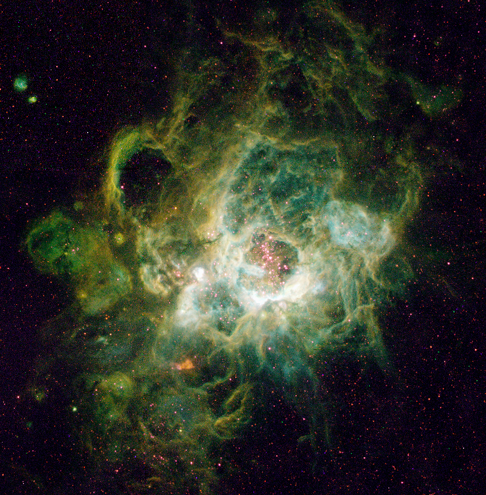
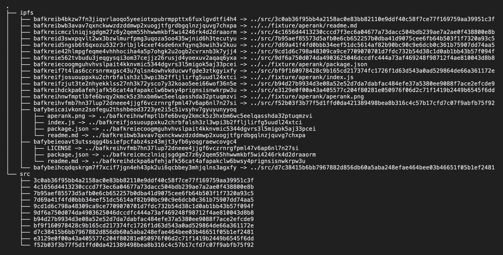
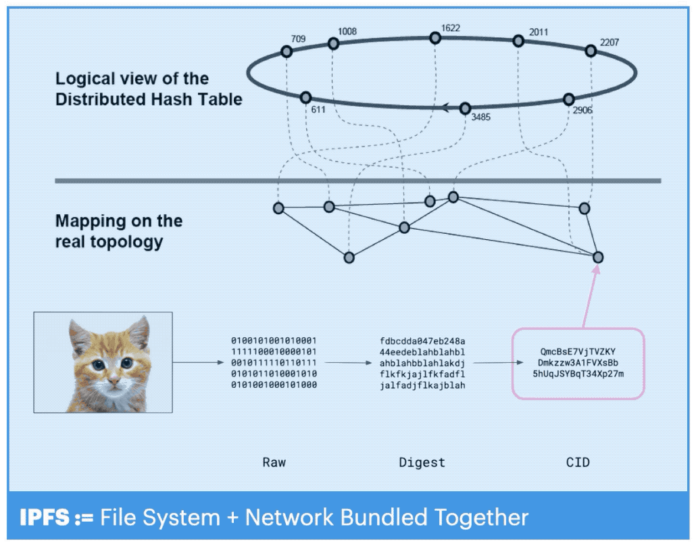
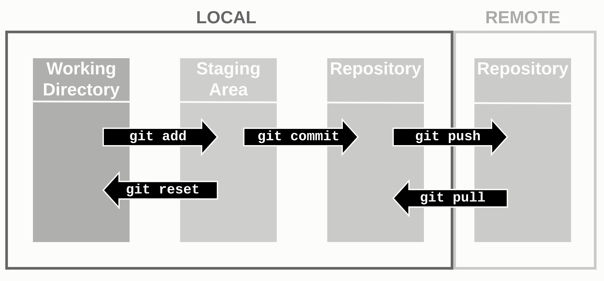

# Nebulus

> Virtual IPFS




Nebulus is an [IPFS](https://ipfs.io/) compatible file system that lets you work privately and locally while preserving all the authenticity traits of IPFS, as well as providing the ability to synchronize with the IPFS network.

## IPFS without the Network

Nebulus makes use of the encoding scheme of IPFS to represent files, without having to use the IPFS network.

You no longer have to keep running an IPFS node to work with IPFS files. Simply work offline and publish to IPFS only when needed.

## Offline and Private IPFS

Nebulus lets you manage files in a manner identical to how files are stored on the public IPFS network, but privately.

## IPFS as Data Packet

Instead of thinking of IPFS as just a "storage system", we can use IPFS as a data packet for private communication between multiple parties.

This means you can store data in Nebulus, and directly send the data over any network transport mechanism without making it public.

For example, we can think of a Nebula server that listens to IPFS messages. You don't have to use the IPFS DHT. Alice can directly post an IPFS data packet to Bob's server, privately.

---

# How it works

## IPFS Hash as Symbolic Link

Instead of having to share everything on the public IPFS network, Nebulus computes the IPFS hash (CID) of the files, locally. 

Once the hash is calculated, a symbolic link is created. The symbolic link points to the original file, and has the file name of the calculated IPFS hash.



We have two folders above:

- **src**: the source folder for the application
- **ipfs**: automatically generated folder for Nebulus for maintaining the IPFS bindings

Note that all files under the `ipfs` folder are symbolic links pointing to other locations, some of which include the files under the `src` folder.

## Offline First

Nebulus is an "Offline First" version of IPFS. Basically it lets you work with IPFS without having to share everything on the IPFS public network.



IPFS is essentially a bundle of two things:

1. Content Addressable Storage
2. Peer to Peer Network

This means, to use IPFS you need to publish everything to the public network. 

With Nebulus, the network and the file system are unbundled and you can use IPFS privately, without having to publish everything to the public IPFS network.


## Like Git, for IPFS

Instead of publishing everything to the public IPFS network immediately, you can work with IPFS files locally, and publish later:


This is similar to how Git works (compared to centralized version control systems like SVN, where everyone needs to publish immediately to the central repository to take advantage of the version control features):



When you use IPFS directly, `ipfs.add()` always adds both to local and remote (public IPFS network) since there is no distinction between local and remote:

```javascript
// adding directly to IPFS means it's immediately shared on the public IPFS network
await ipfs.add(...)
```

However with Nebulus, you now have the option to use Nebulus as an offline buffer. You can work privately and only publish to IPFS when needed:

```javascript
// 1. Privately add an IPFS file to the local file system
let cid = await nebulus.add(Buffer.from("Hello world"))

// 2. "Push" to the public IPFS network
nebulus.push(cid)
```

Essentially, **Nebulus unbundles the IPFS file format from the IPFS network.**

This unbundling means more flexibility. For example you can use other network transport protocols to replicate your IPFS files (such as HTTP, WebRTC, Hypercore, etc.)

---

# Use Cases

## Proof of Existence

Sometimes you may want to openly publish a hash of a file before revealing the contents of the file. This way you can prove later that you had that file at that point in time. You can use Nebulus for this.

This property can be used for various use cases such as:

#### 1. Peer to Peer Proof of Existence

Create a Nebulus file, share its hash with someone over any channel to prove it existed at certain point in time (email, messaging apps, social media), and later reveal content.

#### 2. Blockchain timestamping

Use the IPFS encoding format to store files privately and timestamp on the blockchain (like [Opentimestamps](https://opentimestamps.org/)) without revealing the contents.

#### 3. Mystery NFT Collection

Create an NFT collection that does not reveal its contents initially, but later you can easily "upload" to IPFS with one line of code.

## Private Draft for IPFS

You may want to work with a whole archive of files that you'll publish to IPFS eventually.

For example, you may have a folder structure that looks like this:

```javascript
/
  index.html
  avatar.png
  item.html
```

If you want to reference `item.html` from `index.html` using IPFS CID, you will have to keep updating the URL reference whenever you change the contents of `item.html`. Same goes for `avatar.png`.

And because updating IPFS CIDS means publishing to IPFS, you have no choice but to make every version of your files public whenever you update.

With Nebulus you can do everything locally without publishing.

## Private Storage

Nebulus provides a new way to store and serve IPFS files privately.

Instead of serving your files to the public through the IPFS network, you can serve them privately to those who have permission to access the data.

## IPFS as Data Packet

Because Nebulus has unbundled the IPFS encoding format from the IPFS network, we can go further and ONLY use the IPFS for its encoding format.

You can use IPFS only as a data packet for communicating between parties, instead of thinking of it as a public storage. For example,

1. Use Nebulus to create a file with IPFS CID filename, and attach it in a private email or private message
2. A server for posting IPFS files privately.

## Ephemeral IPFS

> Operate IPFS without running an IPFS node

Sometimes you may only want to use the public IPFS network as a way to replicate your file once, but you may not care about the permance of the file.

To be more precise, you may want to use the IPFS network as a replacement for `HTTP POST`, instead of thinking of IPFS as a persistent storage.

Here's an example workflow:

1. Privately work with files on Nebulus
2. Publish to the public IPFS network
3. Wait for another node to pin or replicate the files
4. Stop seeding

You can use the `upload` event to achieve this: 

```javascript
await nebulus.connect()
nebulus.on("push", (cid) => {
  // do something here
})
```

Because the `upload` event fires when a CID is successfully found on an IPFS gateway (ipfs.io), you can be sure that it will be pinned for at least a while.

You can take advantage of this feature when you are certain that whoever the file is intended for will pick it up eventually as long as it's discovered in the gateway.

This way you don't have to run your own IPFS node.

---

# Install

```
npm install nebulus
```

---

# Examples

## Add a Buffer to Nebulus

```javascript
const Nebulus = require('nebulus');
const nebulus = new Nebulus()
const run = async () => {
  const buffer = Buffer.from("hello world")
  const cid = await nebulus.add(buffer)
  console.log("cid", cid)
}
run()
```

## Add a Local File to Nebulus

```javascript
const Nebulus = require('nebulus')
const nebulus = new Nebulus()
const run = async () => {
  await fs.promises.writeFile(__dirname + "/fixture/hello.txt", "hello world")
  const cid = await nebulus.add(__dirname + "/fixture/hello.txt")
  console.log("cid", cid)
}
run()
```

## Download a Web File to Nebulus

```javascript
const Nebulus = require('nebulus')
const nebulus = new Nebulus()
const run = async () => {
  const cid = await nebulus.download("https://ipfs.io/ipfs/bafkreifzjut3te2nhyekklss27nh3k72ysco7y32koao5eei66wof36n5e")
  console.log("cid", cid)
}
run()
```

## Create a Folder on Nebulus

```javascript
const Nebulus = require('nebulus')
const nebulus = new Nebulus()
const run = async () => {
  const files = [
    await nebulus.add("https://raw.githubusercontent.com/skogard/rarepress.js/0ad35d7da27a4d1e5f990a3bcf301e3fa9bae7ec/README.md"),
    await nebulus.add("https://raw.githubusercontent.com/skogard/rarepress.js/0ad35d7da27a4d1e5f990a3bcf301e3fa9bae7ec/index.js"),
    await nebulus.add("https://raw.githubusercontent.com/skogard/rarepress.js/0ad35d7da27a4d1e5f990a3bcf301e3fa9bae7ec/package.json"),
    await nebulus.add("https://github.com/skogard/rarepress.js/raw/0ad35d7da27a4d1e5f990a3bcf301e3fa9bae7ec/press.png")
  ]
  let cid = await nebulus.folder({
    "readme.md": files[0],
    "index.js": files[1],
    "package.json": files[2],
    "press.png": files[3]
  })
  let files = await fs.promises.readdir("storage/ipfs/" + cid)
  cnosole.log("files", files)
}
run()
```

## Pull a File from IPFS

```javascript
const Nebulus = require('nebulus')
const nebulus = new Nebulus()
const run = async (cid) => {
  await nebulus.connect()
  nebulus.on("pull", (pulled_cid) => {
    console.log("pulled cid", pulled_cid)
    fs.createReadWtream("storage/ipfs/" + pulled_cid).pipe(process.stdout)
  })
  nebulus.pull(cid)
}
const cid = "bafkreifzjut3te2nhyekklss27nh3k72ysco7y32koao5eei66wof36n5e"
run(cid)
```

## Upload a File to IPFS

```javascript
const Nebulus = require('nebulus')
const nebulus = new Nebulus()
const run = async (cid) => {
  const buffer = Buffer.from("never gonna give you up")
  const cid = await nebulus.add(buffer)
  nebulus.on("push", (uploaded_cid) => {
    // check the following uploaded URL in the browser
    console.log("https://ipfs.io/ipfs/" + uploaded_cid)
  })
  nebulus.push(cid)
}
```

---


# API

1. `add`: Add to IPFS
2. `download`: Download web file into IPFS
3. `folder`: Create a folder from IPFS CIDs
4. `get`: Get file contents by CID
5. `stream`: Get file stream by CID
6. `connect`: initialize and connect to the public IPFS network
7. `disconnect`: stop and disconnect from the public IPFS network
8. `push`: Publish to the global IPFS network, wait till it's replicated to public IPFS gateways, and trigger "push" event.
9. `pull`: Pull a CID from the IPFS network into Nebulus. trigger "pull" event when download is complete.

## Initizlizing

### constructor

You can initialize a Nebulus instance using a constructor:

```javascript
const Nebulus = require('nebulus')
const nebulus = new Nebulus(<options>)
```

Where `<options>` can have the following attributes:

- `path`: storage path. if left out, it's `.nebulus` (optional)
- `max`: max file size in MB. If left out, no max limit (optional)

The `path` is where the Nebulus file system will be constructed. For example:

```javascript
const Nebulus = require('nebulus')
const nebulus = new Nebulus({ path: "storage" })
```

will create a folder named `storage` in the current directory, and store all the files there.

If the `path` is left empty, it will create and use a hidden folder named `.nebulus`. For example:

```javascript
const Nebulus = require('nebulus')
const nebulus = new Nebulus()
```

Will create a `.nebulus` folder in the current execution folder with unlimited file size.

Also, you can use the `max` attribute to limit the max file size:

```javascript
const Nebulus = require('nebulus')
const nebulus = new Nebulus({max: 100})
```

will create a `.nebulus` folder and allow up to 100MB file storage.


## Writing

### add

Add local data to Nebulus.

#### Adding buffer

```javascript
const buffer = Buffer.from("hello world")
const cid = await nebulus.add(buffer)
```

#### Adding files

```javascript
await fs.promises.writeFile(__dirname + "/fixture/hello.txt", "hello world")
const cid = await nebulus.add(__dirname + "/fixture/hello.txt")
```

### download

Download external web files to Nebulus.

#### Download from any URL

```javascript
const cid = await nebulus.download("https://thisartworkdoesnotexist.com")
```

#### Download from IPFS gateway

```javascript
const cid = await nebulus.download("https://ipfs.io/ipfs/bafkreifzjut3te2nhyekklss27nh3k72ysco7y32koao5eei66wof36n5e")
```

### folder

Create a depth-1 folder (Nested folders not yet supported)

#### Add files and then create a folder with the CIDs

```javascript
const file_cids = [
  await nebulus.add(__dirname + "/fixture/aperank/aperank.png"),
  await nebulus.add(__dirname + "/fixture/aperank/readme.md"),
  await nebulus.add(__dirname + "/fixture/aperank/index.js"),
  await nebulus.add(__dirname + "/fixture/aperank/package.json")
]
let root_cid = await nebulus.folder({
  "aperank.png": cids[0],
  "readme.md": cids[1],
  "index.js": cids[2],
  "package.json": cids[3],
})
```

#### Add files and create a folder simultaneously

```javascript
let cid = await nebulus.folder({
  "aperank.png": await nebulus.add(__dirname + "/fixture/aperank/aperank.png"),
  "readme.md": await nebulus.add(__dirname + "/fixture/aperank/readme.md"),
  "index.js": await nebulus.add(__dirname + "/fixture/aperank/index.js"),
  "package.json": await nebulus.add(__dirname + "/fixture/aperank/package.json")
})
```

## Reading

### get

Get buffer by CID

```javascript
let buf = await nebulus.get("bafkreifzjut3te2nhyekklss27nh3k72ysco7y32koao5eei66wof36n5e")
```


### stream

Get file stream by CID

```javascript
let stream = nebulus.stream("bafkreifzjut3te2nhyekklss27nh3k72ysco7y32koao5eei66wof36n5e")
stream.pipe(process.stdout)
```


## IPFS

interact with the public global IPFS network.

### connect

Initializing IPFS node.

> You must first initialize the node before doing anything.

```javascript
await nebulus.connect()
```

### disconnect

Stop IPFS node

```javascript
await nebulus.disconnect()
```

### push

Publishing one or more local Nebulus CIDs to the global IPFS network:

```javascript
await nebulus.connect()
nebulus.push(<cid>)
```

Triggers an "upload" event when the file is successfully replicated to IPFS gateways

```javascript
await nebulus.connect()
nebulus.on("push", (cid) => {
  // do something here
})
nebulus.push(cid)
```

### pull

pull files from the public IPFS network to Nebulus

```javascript
await nebulus.connect()
nebulus.pull(cid)
```

Emits a "pull" event when pull is complete

```javascript
await nebulus.connect()
nebulus.on("pull", (cid) => {
  // do something
})
nebulus.pull(cid)
```

---
